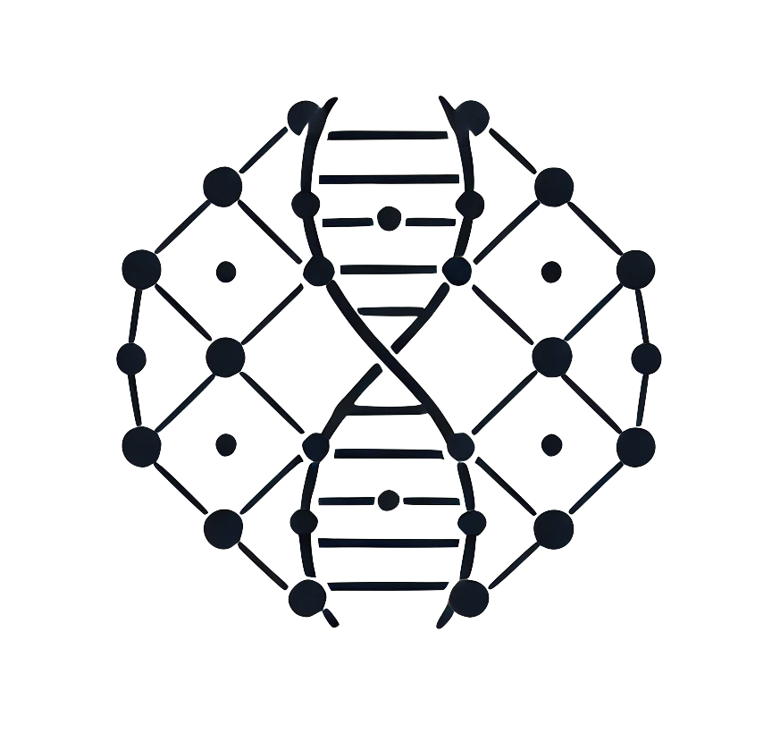

[](https://hex.pm/packages/ontogen_cli)
[](https://hexdocs.pm/ontogen_cli/)
[](https://github.com/ontogen/cli/blob/main/LICENSE.md)

[](https://github.com/ontogen/cli/actions/workflows/elixir-build-and-test.yml)
[](https://github.com/ontogen/cli/actions/workflows/elixir-quality-checks.yml)

<br />
<div align="center">
  <a href="https://ontogen.io">
    
  </a>

<h2 align="center"><code>og</code> - the Ontogen CLI</h2>

  <p align="center">
    CLI for the Ontogen version control system for RDF datasets
    <br />
    <a href="https://ontogen.io"><strong>Explore the docs »</strong></a>
    <br />
    <br />
    <a href="https://github.com/ontogen/cli/blob/main/CHANGELOG.md">Changelog</a>
    ·
    <a href="https://github.com/ontogen/cli/issues">Report Bug</a>
    ·
    <a href="https://github.com/ontogen/cli/issues">Request Feature</a>
    ·
    <a href="https://github.com/ontogen/ontogen/discussions">Discussions</a>
  </p>
</div>


## About the Project

`og` is the command-line interface for Ontogen, a Data-Control-Management (DCM) solution specifically designed for RDF data in SPARQL triple stores. It provides an easy-to-use interface for version control capabilities similar to Git, but tailored for RDF datasets.


## Usage

Here's a basic example of how to use the Ontogen CLI:

```sh
$ og init --adapter Oxigraph
Initialized empty Ontogen repository in /Users/JohnDoe/example

$ og setup
Set up Ontogen repository

$ og add data.ttl

$ og commit --message "Initial commit"
[(root-commit) 6fc09c94768204983d0409d28e0796ec3f17cef46e57c5cb1248424d3922040d] Initial commit
 3 insertions, 0 deletions, 0 overwrites

$ og log --changes
ec8108e3f4 - Initial commit (now) <John Doe john.doe@example.com>
   <http://www.example.org/employee38>
 +     <http://www.example.org/familyName> "Smith" ;
 +     <http://www.example.org/firstName> "John" ;
 +     <http://www.example.org/jobTitle> "Assistant Designer" .
```

_For more examples, setup instruction and a command reference, please refer to the [User Guide](https://ontogen.io/user-guide/)_


## Contact

Marcel Otto - [@marcelotto@mastodon.social](https://mastodon.social/@marcelotto) - [@MarcelOttoDE](https://twitter.com/MarcelOttoDE) - marcelotto@gmx.de


## Acknowledgments

<table style="border: 0;">  
<tr>  
<td><a href="https://nlnet.nl/"></a></td>  
<td><a href="https://nlnet.nl/assure" ></a></td>  
<td><a href="https://www.jetbrains.com/?from=RDF.ex"></a></td>  
</tr>  
</table>  

This project is funded through [NGI Assure](https://nlnet.nl/assure), a fund established by [NLnet](https://nlnet.nl/) with financial support from the European Commission's [Next Generation Internet](https://ngi.eu/) program.

[JetBrains](https://www.jetbrains.com/?from=RDF.ex) supports the project with complimentary access to its development environments.


## License

Distributed under the MIT License. See `LICENSE.md` for more information.
